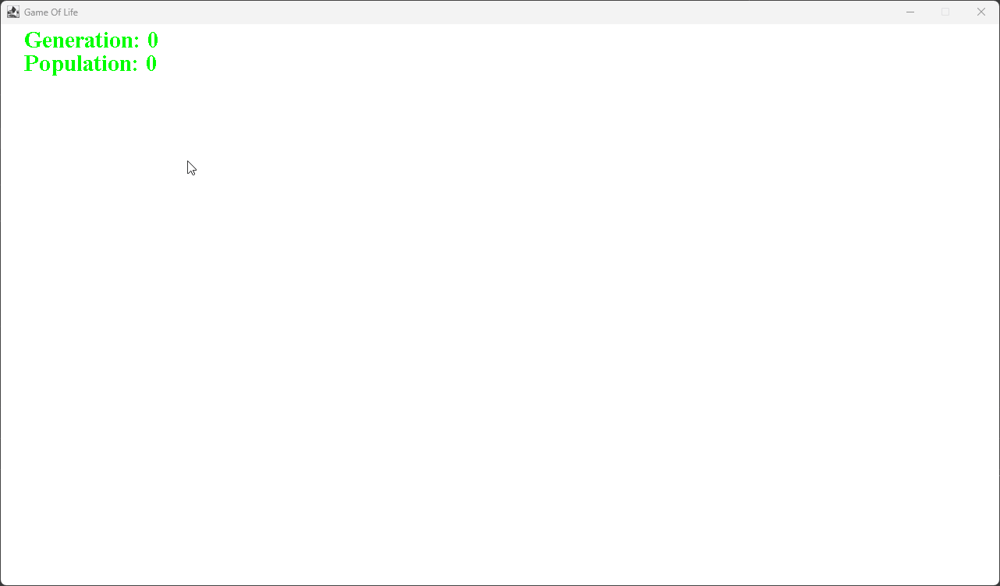

# Game of Life



## Overview

The Game of Life is a cellular automaton devised by mathematician John Conway. This Java-based implementation simulates the Game of Life, where cells in a grid live, die, or reproduce based on simple rules. The project features interactive elements allowing users to modify the grid via mouse clicks and keyboard inputs.

## Features

- **Interactive Grid**: Set cells alive or dead with mouse clicks and dragging.
- **Pause and Resume**: Pause or resume the simulation using keyboard controls.
- **Clear Board**: Clear the grid and reset the simulation.
- **Dynamic Updates**: Real-time updates of cell states according to Conway's rules.

## Installation

1. **Clone the Repository**

   ```bash
   https://github.com/Princelad/Game-Of-Life.git
   ```

2. **Navigate to the Project Directory**

   ```bash
   cd GameOfLife
   ```

3. **Compile the Project**

   Ensure you have Java Development Kit (JDK) installed. Compile the Java files using:

   ```bash
   javac -d bin src/Main/*.java
   ```

4. **Run the Project**

   Execute the `Main` class to start the simulation:

   ```bash
   java -cp bin Main.Main
   ```

## Usage

- **Mouse Controls**:
    - **`Left Click`**: Set cell to alive.
    - **`Right Click`**: Set cell to dead.
    - **Drag**: Continue modifying cells while dragging the mouse.

- **Keyboard Controls**:
    - **`ESC`**: Toggle pause/resume the simulation.
    - **`ENTER`**: Resume the simulation after clearing the board.
    - **`R`**: Clear the board and reset the simulation.

## Key Bindings

- **ESC**: Toggles the pause state of the simulation. When paused, the simulation stops updating. Pressing ESC again resumes it.
- **ENTER**: Resumes the simulation after it has been cleared using the R key.
- **R**: Clears the board, resets the simulation, and pauses it. Pressing ENTER will resume the simulation after clearing.
- **Left Mouse Button**: When pressed and held, sets cells to alive. Dragging while holding the left button will continue to set cells alive.
- **Right Mouse Button**: When pressed and held, sets cells to dead. Dragging while holding the right button will continue to set cells dead.

## Classes

### `Main`

The entry point for the application. Sets up the JFrame and adds the `board` component.

### `board`

A JPanel that manages the game loop, updates, and rendering. It implements `Runnable` for the game loop.

- **Methods**:
    - `launch()`: Starts the game loop in a new thread.
    - `update()`: Updates the game state based on user input and simulation rules.
    - `paint(Graphics g)`: Renders the grid and cell states.

### `playManager`

Handles the game logic, including cell state management, simulation updates, and rendering.

- **Methods**:
    - `countNeighbours(int x, int y)`: Counts the live neighbors of a cell.
    - `update()`: Applies Game of Life rules to update cell states.
    - `draw(Graphics g)`: Draws the grid and cell states on the JPanel.
    - `setCellState(int mouseX, int mouseY, boolean alive)`: Sets the state of a cell based on mouse coordinates.
    - `clearBoard()`: Clears the grid and resets the simulation.

### `keyHandler`

Manages keyboard and mouse inputs for interacting with the game.

- **Methods**:
    - `keyPressed(KeyEvent e)`: Handles key presses for pausing, resuming, and clearing the board.
    - `mousePressed(MouseEvent e)`: Handles mouse button presses for setting cell states.
    - `mouseDragged(MouseEvent e)`: Updates cell states while dragging the mouse.

## License

This project is licensed under the MIT License - see the [LICENSE](LICENSE) file for details.

## Acknowledgements

- Inspired by John Conway's Game of Life.
- Developed as a personal project in Java.
